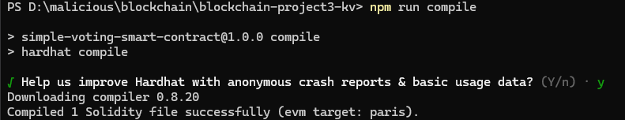
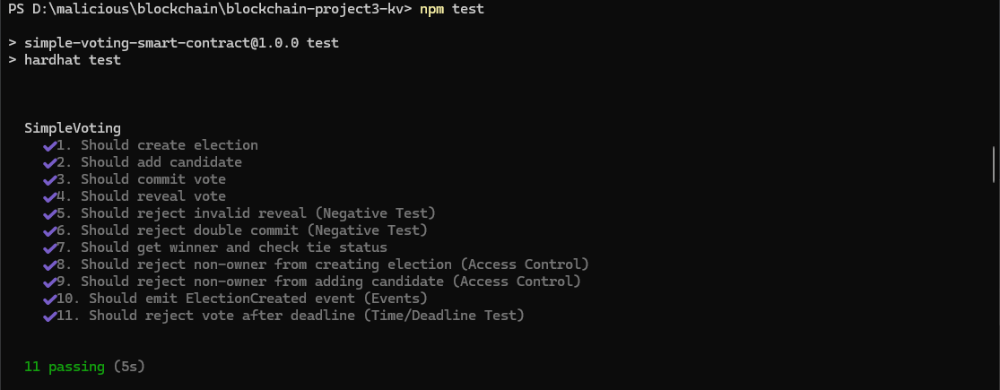
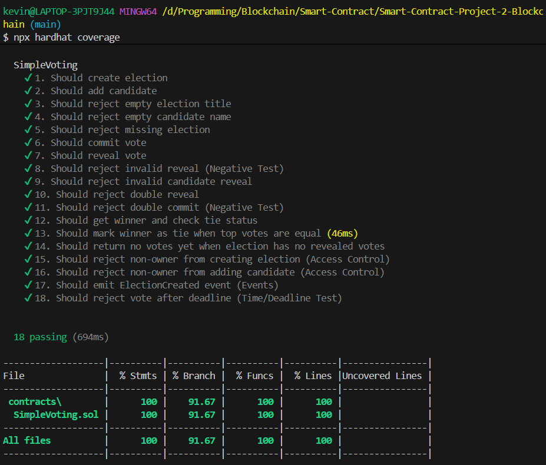
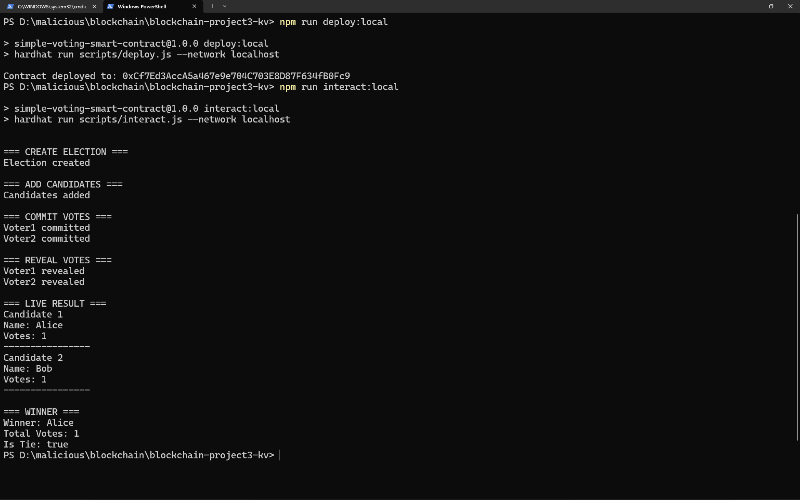
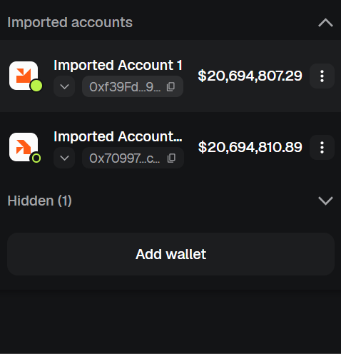
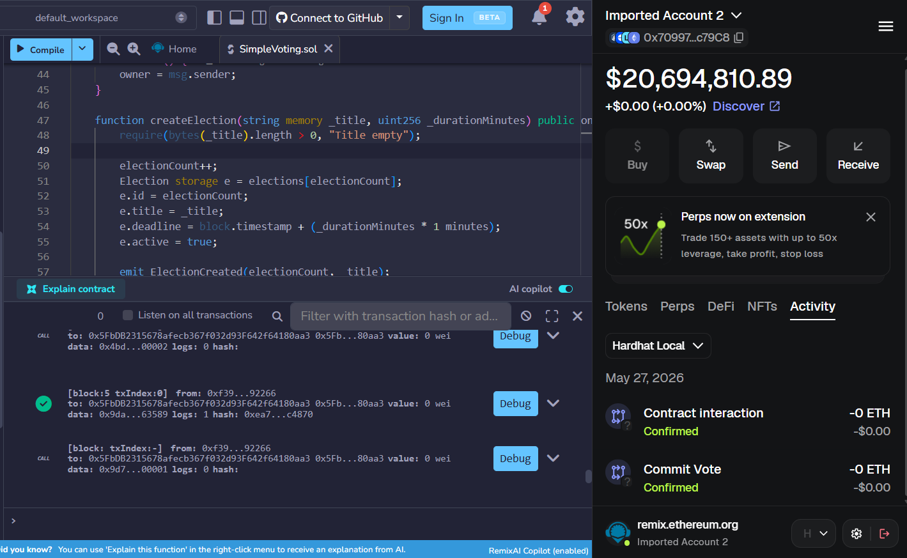
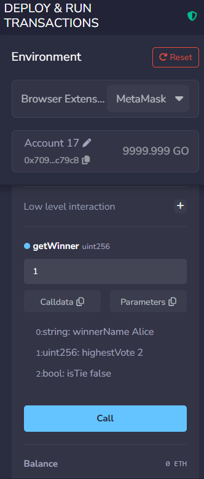

# Simple Voting Smart Contract

## Deskripsi
Simple Voting adalah smart contract berbasis Solidity untuk membuat beberapa sesi voting. Owner dapat membuat election dan menambahkan kandidat, sedangkan voter memberikan suara dengan mekanisme commit-reveal agar pilihan tidak langsung terlihat saat tahap commit.

## Anggota Kelompok
| No | Nama | NRP | Kontribusi |
|---|---|---|---|
| 1 | Rafi' Afnaan Fathurrahman | 5027231040 | Smart Contract |
| 2 | Dzaky Faiq Fayyadhi | 5027231047 | Frontend UI/UX |
| 3 | Amoes Noland | 5027231028 | Integrasi Web3 |

## Fitur
- Owner dapat membuat election.
- Owner dapat menambahkan kandidat ke election tertentu.
- Contract menolak judul election kosong dan nama kandidat kosong.
- Voter melakukan commit vote menggunakan hash.
- Voter melakukan reveal vote menggunakan candidate ID dan secret.
- Contract mencegah double commit dan double reveal.
- Contract memiliki deadline commit vote per election.
- Contract dapat menampilkan detail election, kandidat, jumlah suara, pemenang sementara, dan status seri.
- Event logging untuk election baru, kandidat baru, commit vote, dan reveal vote.

## Tech Stack
- Solidity `^0.8.20`
- Hardhat 2
- JavaScript
- MetaMask

## Struktur Project
```text
contracts/SimpleVoting.sol
test/SimpleVoting.test.js
scripts/deploy.js
scripts/interact.js
hardhat.config.js
README.md
```

## Cara Menjalankan

### Prerequisites
- Node.js v18+
- npm
- MetaMask

### Installation
```bash
npm install
```

### Compile
```bash
npm run compile
```

### Test
```bash
npm test
```

### Coverage
```bash
npx hardhat coverage
```

### Deploy ke Localhost
Terminal 1:
```bash
npm run node
```

Terminal 2:
```bash
npm run deploy:local
```

### Interaksi Script
Sebelum menjalankan script, isi `CONTRACT_ADDRESS` di `scripts/interact.js` dengan address hasil deploy.

```bash
npm run interact:local
```

## Contract Address
```text
0x5FbDB2315678afecb367f032d93F642f64180aa3
```

## A lil bit step by step
1. Tambahkan network Hardhat Local di MetaMask dengan RPC `http://127.0.0.1:8545` dan chain ID `31337`.
2. Import minimal dua private key account dari output `npm run node`.
3. Deploy contract ke localhost.
4. Buka Remix IDE dan compile `SimpleVoting.sol`.
5. Pada tab Deploy & Run Transactions, pilih environment `Browser Extension`.
6. Load contract lewat `Add Contract` menggunakan address hasil deploy.
7. Gunakan owner account untuk menjalankan `createElection("Ketua Kelas", 60)`.
8. Gunakan owner account untuk menjalankan `addCandidate(1, "Alice")` dan `addCandidate(1, "Bob")`.
9. Buat hash vote dari candidate ID dan secret, misalnya candidate `1` dengan secret `secret123`.
10. Gunakan voter account untuk menjalankan `commitVote(1, hash)`.
11. Gunakan voter account yang sama untuk menjalankan `revealVote(1, 1, "secret123")`.
12. Cek hasil melalui `getCandidate(1, 1)`, `getElection(1)`, dan `getWinner(1)`.
13. Perhatikan nilai `isTie` dari `getWinner()` untuk mengetahui apakah suara tertinggi masih seri.

## Contoh Hash Vote
Gunakan Node.js console dari folder project:

```bash
node
```

Lalu jalankan:

```javascript
const { ethers } = require("ethers");
ethers.keccak256(ethers.solidityPacked(["uint256", "string"], [1, "secret123"]));
```

Hash yang dihasilkan dipakai sebagai parameter `_hash` pada `commitVote`.

## Screenshot
### Compile Berhasil


### Test Passing


### Coverage Berhasil


### Deploy Berhasil


### MetaMask Connected


### Transaksi Berhasil


### Hasil Winner

